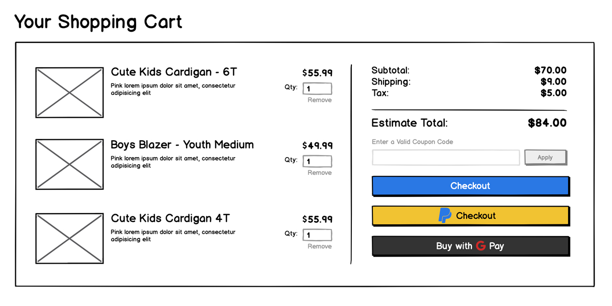

# Group project

This is your final group-project, it sums up many concepts you’ve learned in during this training and will help you to resume them all.

You have to create a full-stack app to add products on a shopping cart.

Make sure to:

- Use proper indentation.
- Comment your code where needed.
- Lint your code before committing.

## Front End

- Use the React CLI to set-up the client folder, running `npx create-react-app client`.
- Your app should allow users to do the following:
  - View a list of the available products (see the wireframe).
  - Add a product to your shopping cart. When a new product is added, the cart should reflect the changes automatically. In case a product has not been added yet, instead of an input with the quantity, render a button saying "Add product".
  - Remove a product from the cart and update the cart content.

The wireframe is just a reference, you don't need to implement all the payment system buttons and a real payment process.



### Specs 🥓

- Show a loader (e.g. spinner) when fetching the products list.
- Create an `ApiClient` service as a JavaScript Module that shares the logic for calling `fetch` and abstracts it behind methods (i.e.: `apiClient.getProducts()`).

## Back End

Create a `/server` folder and implement a [Koa](https://koajs.com/) REST server connected to a database with [mysql](https://www.mysql.com/). In case you won't be able to create a local database on your device, you can create a static json file and use it as a database for this exercise

It should offer the following API methods:

- `GET /products` - Returns a list of all the available products, in JSON format. You can mock some of them and add them into the database to work with some real data.
The products should have the following structure. 

  ```json
  [
    {
      "id": "…",
      "title": "Keyboard MX",
      "description": "A good keyboard for fast typing",
      "price": 29.99,
      "currency": "eur"
    },
    {
      "id": "…",
      "title": "Mouse MX",
      "description": "The fastest mouse in the world",
      "price": 19.99,
      "currency": "eur"
    }
  ]
  ```

- `POST /orders` - Creates a new order in the database with the following parameters:

  - `products`: *Array<Products>*. An array of added products. Empty in the beginning
  - `total`: *Number.* Total amount of the order.
  - `discount`: *Number*. An applied discount in percentage. Should be a number between 0 and 1.

  All these parameters are mandatory. The server should return a `201` status code for success, and a `400` HTTP status code in case any parameter is missing.

- `PUT /orders/:orderId` - Update an existing order in the database. The added or removed products should reflect the changes on the total computed price.
This endpoint should return the newly computed order.

## Extra

In case you fullfill all the requirements and have extra time, try to expand the existing functionalities integrating authentication and saving user sessions across browser refresh.